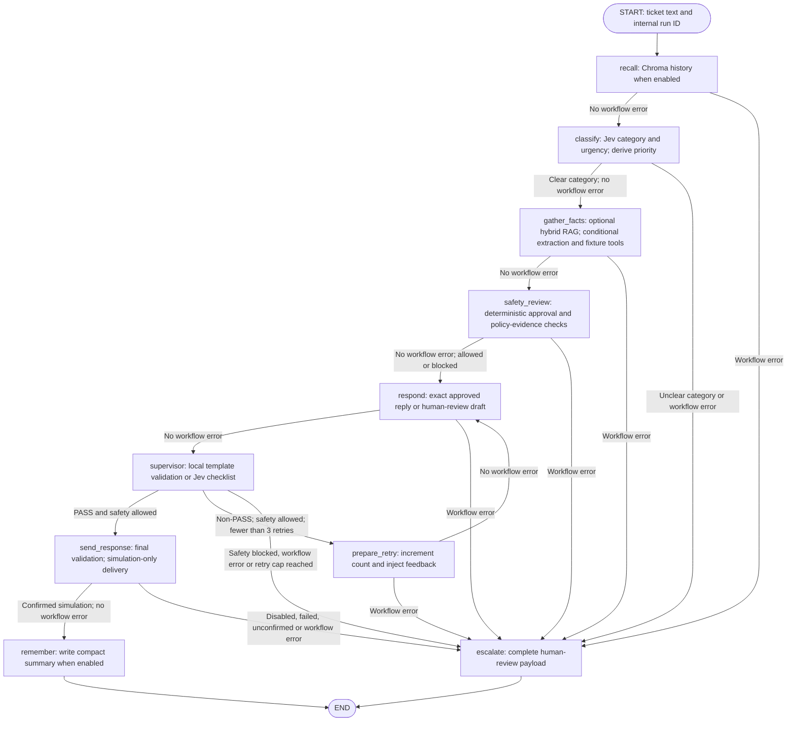
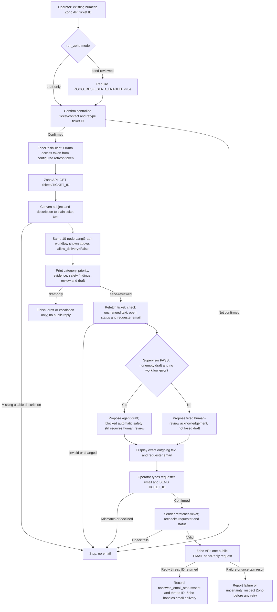
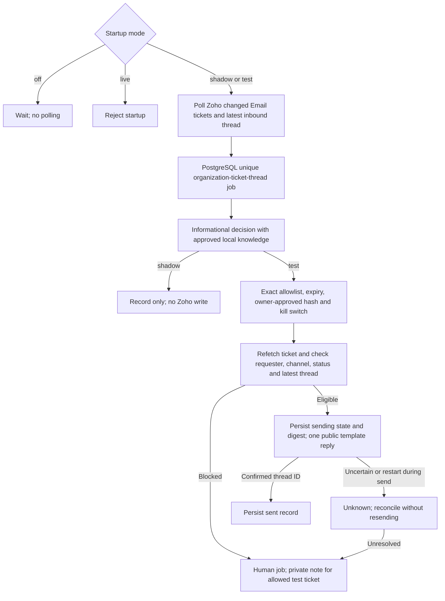

# Implemented architecture

The local graph, interactive Zoho runner and controlled worker are separate
paths. Real customer auto-send is disabled. The worker is implemented but
undeployed; its `live` mode refuses startup.

## Local graph



Node names and routing above match `build_graph` in
[`src/agent/graph.py`](../src/agent/graph.py), reviewed 2026-10-08.
Each retry repeats only `respond` and `supervisor`, with at most three retries
after the initial draft. A blocked safety decision still proceeds through
drafting and review, then escalates even if the supervisor passes.

`gather_facts` first runs bounded hybrid PDF retrieval/evidence review when RAG
is enabled. Supported informational intents then skip order extraction and
the three fixture tools. Other intents extract an explicit order ID/reason
and dispatch order lookup, shared-policy checks and FAQ search concurrently
by default. TASK-20's comparison runner alone selects sequential dispatch;
both modes retain individual tool failures as unavailable results. These are
operations inside `gather_facts`, not additional graph nodes.

Guarded processing errors follow the shown escalation routes. Chroma query/
write failures are caught inside the memory nodes and reported in state;
they do not normally abort the workflow. `remember` and `escalate` have direct
edges to END. Successful simulated delivery has already set terminal status
`sent` before remembering; escalation sets `escalated`. Sending disabled,
missing configuration, invalid final text or unconfirmed delivery routes to
escalation. No real Zoho sender can deliver from this local graph.

Escalation includes ticket, tool results,
failed drafts with feedback and a human-readable reason; it does not assign a
Zoho human by itself.

### Models, tools and evidence

With RAG enabled every ticket uses Jev category/urgency Choices through
OpenRouter Decisions. Generative chat calls perform evidence review, explicit
ticket-detail extraction when needed, and cited human drafts. Generated drafts
receive one Jev Decisions request with three checklist questions. Each must
select `pass` with probability at least 0.90; uncertainty/malformed responses
are non-approval. This provisional threshold is not calibrated. Fixed reasons
provide feedback, not sentence-level unsupported-claim identification.
Exact approved FAQ templates are checked locally without a supervisor API call.
The checklist completion score is separate from Jev probabilities.

Only fixed application-owned tools run; no model-generated code or shell
commands execute. Docker is an unused placeholder, not a security boundary.
The order fixture is fictional. The validated
[shared business policy](../data/policies/support_v1.json) supplies eligibility
rules and generated PDF text. Policy results require matching active retrieved
ID/version/hash/rule metadata; obsolete policy references are filtered.
Business-policy provenance is separate from send policy `informational_only_v4`.

[The 13-PDF corpus](../knowledgebase/README.md) uses dense MiniLM Chroma and
sparse BM25 SQLite, fused by RRF. The search agent may use at most three
allowlisted searches per gather step. Citation validity is not proof of
entailment, requester identity or authority. Informational simulation approval
requires scoped, hash-pinned evidence and exact versioned reply text.
Unreviewed/reference-only PDFs cannot authorize sending.

Short-term state is per run. Ordinary sample and Zoho runs use persistent
Chroma; single synthetic runs use fresh ephemeral memory. Complete 50/200-case
batches share fresh ephemeral historical memory; persistent history is untouched.
Only confirmed successful simulations are remembered. Recall never verifies
current business facts and is excluded from approval/supervisor factual evidence.

Node/tool/model events go to JSONL. Local logs may contain bodies/drafts;
worker logs omit them. LangGraph async update streaming emits completed node
updates, not token streams. See [commands](../README.md).

## Interactive Zoho runner

This is the current connection between the agent and Zoho Desk. Zoho stores
the ticket and sends the email; the local agent analyzes the ticket and
produces a draft. The operator controls the final reviewed send.



### What crosses the integration boundary

- **Input:** `--ticket-id` is Zoho's API `id`, not the visible ticket number
  such as `#101`. The fetched subject/description become graph `ticket_text`;
  a unique internal run ID stays separate from the Zoho ID.
- **Agent work:** recall, Jev triage, conditional tools/RAG, safety decisions,
  drafting and review run locally using the configured models. Zoho ticket
  fetching does not make the fictional order tools authoritative. The graph
  cannot send in this command because delivery is explicitly disabled.
- **Reviewed output:** the wrapper sends outside the graph after human
  confirmation. A safety-blocked run can remain `terminal_status=escalated`
  even if a subsequent manually reviewed email succeeds. Its separate
  `reviewed_email_status` and content source identify that action.
- **Email routing:** the recipient is the fetched ticket's requester `email`.
  The sender address comes from `ZOHO_DESK_FROM_EMAIL`. The client posts to
  `tickets/TICKET_ID/sendReply` with email content and public/immediate-send
  parameters. A confirmed thread ID establishes API acceptance, not inbox
  receipt; Zoho and the recipient's mail system handle actual delivery.
- **Credentials and records:** `.env` supplies regional Zoho endpoints,
  organization ID and OAuth credentials. The client sends its access token
  and organization ID to Zoho; the agent does not receive credentials as
  evidence. Fetch/send outcomes use the existing JSONL logging path.

Commands, run from the repository root:

```powershell
python -m src.agent.run_zoho --ticket-id TICKET_API_ID --draft-only
python -m src.agent.run_zoho --ticket-id TICKET_API_ID --send-reviewed
```

Replace `TICKET_API_ID` with the numeric ID of a ticket/contact you control.
Both commands call Zoho and configured models; only `--send-reviewed` can
attempt an email. There is no unattended sending in this path. The separate
`python -m src.eval.zoho_smoke --ticket-id TICKET_API_ID --send` command tests
delivery of a fixed message and does not run the agent.

`run_zoho` fetches an existing ticket's subject/description, runs the graph with
delivery disabled, and prints the draft and findings. Usable ticket text can
be analyzed across channels. `--send-reviewed` is a separate, controlled human
send: review exact text and confirm requester/ticket; PASS proposes the draft,
otherwise a fixed acknowledgement is proposed. Ticket changes block sending;
an uncertain send is never automatically repeated. This path is not polling,
latest-thread ingestion or unattended customer support.

Implementation: [`run_zoho.py`](../src/agent/run_zoho.py) and
[`zoho_desk_client.py`](../zoho_desk_client.py). The interactive runner does
not provide the worker's durable deduplication or latest-thread checks.
Rerunning and confirming a reviewed send can post another email; an uncertain
send is never automatically repeated.

## Separate controlled worker



The worker does not call the graph, draft model prose or use Chroma approval
evidence. Repository knowledge is still `review_required`; owner approval is
an additional requirement. Paid Render/PostgreSQL are selected but not deployed.
Polling/restart/reconciliation need controlled integration validation. Real
release additionally requires authoritative sources, identity verification,
independently reviewed tickets and a separate live decision. See
[deployment prerequisites](controlled_render.md).
