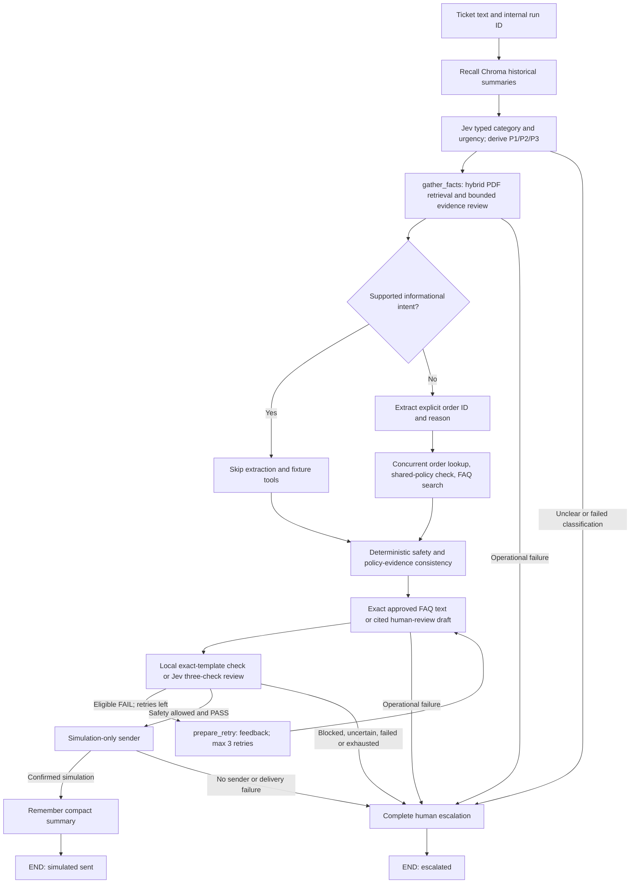
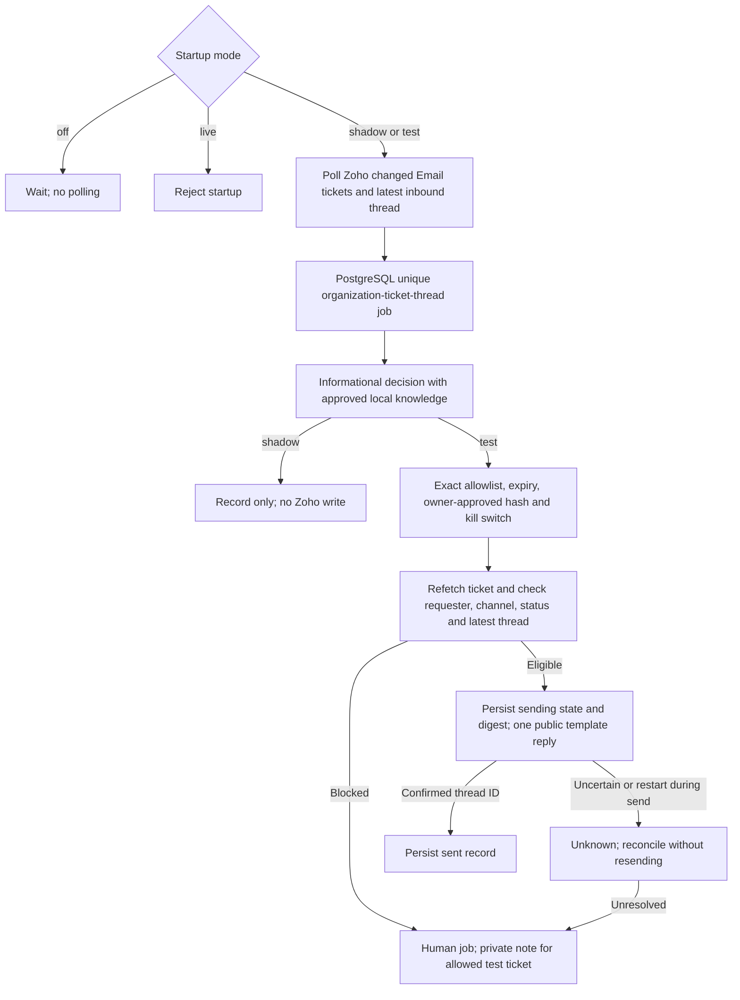

# Implemented architecture

The local graph, interactive Zoho runner and controlled worker are separate
paths. Real customer auto-send is disabled. The worker is implemented but
undeployed; its `live` mode refuses startup.

## Local graph

The graph topology is `recall → classify → gather_facts → safety_review →
respond → supervisor`, followed by bounded retry, simulated delivery and
remember, or escalation. Guarded operational errors escalate; Chroma recall/
storage errors are nonfatal and visible in state. A blocked safety gate cannot
be overridden by supervisor PASS. Escalation includes ticket, tool results,
failed drafts with feedback and a human-readable reason; it does not assign a
Zoho human by itself.

### Models, tools and evidence

With RAG enabled every ticket uses Jev category/urgency Choices through
OpenRouter Decisions. Generative chat calls perform evidence review, explicit
ticket-detail extraction when needed, and cited human drafts. Generated drafts
receive one Jev Decisions request with three checklist questions. Each must
select `pass` with probability at least 0.90; uncertainty/malformed responses
are non-approval. This provisional threshold is not calibrated. Fixed reasons
provide feedback, not sentence-level unsupported-claim identification.
Exact approved FAQ templates are checked locally without a supervisor API call.
The checklist completion score is separate from Jev probabilities.

Only fixed application-owned tools run; no model-generated code or shell
commands execute. Docker is an unused placeholder, not a security boundary.
The order fixture is fictional. The validated
[shared business policy](../data/policies/support_v1.json) supplies eligibility
rules and generated PDF text. Policy results require matching active retrieved
ID/version/hash/rule metadata; obsolete policy references are filtered.
Business-policy provenance is separate from send policy `informational_only_v4`.

[The 13-PDF corpus](../knowledgebase/README.md) uses dense MiniLM Chroma and
sparse BM25 SQLite, fused by RRF. The search agent may use at most three
allowlisted searches per gather step. Citation validity is not proof of
entailment, requester identity or authority. Informational simulation approval
requires scoped, hash-pinned evidence and exact versioned reply text.
Unreviewed/reference-only PDFs cannot authorize sending.

Short-term state is per run. Ordinary sample and Zoho runs use persistent
Chroma; single synthetic runs use fresh ephemeral memory. Complete 50/200-case
batches share fresh ephemeral historical memory; persistent history is untouched.
Only confirmed successful simulations are remembered. Recall never verifies
current business facts and is excluded from approval/supervisor factual evidence.

Node/tool/model events go to JSONL. Local logs may contain bodies/drafts;
worker logs omit them. LangGraph async update streaming emits completed node
updates, not token streams. See [commands](../README.md).

## Interactive Zoho runner

`run_zoho` fetches an existing ticket's subject/description, runs the graph with
delivery disabled, and prints the draft and findings. Usable ticket text can
be analyzed across channels. `--send-reviewed` is a separate, controlled human
send: review exact text and confirm requester/ticket; PASS proposes the draft,
otherwise a fixed acknowledgement is proposed. Ticket changes block sending;
an uncertain send is never automatically repeated. This path is not polling,
latest-thread ingestion or unattended customer support.

## Separate controlled worker

The worker does not call the graph, draft model prose or use Chroma approval
evidence. Repository knowledge is still `review_required`; owner approval is
an additional requirement. Paid Render/PostgreSQL are selected but not deployed.
Polling/restart/reconciliation need controlled integration validation. Real
release additionally requires authoritative sources, identity verification,
independently reviewed tickets and a separate live decision. See
[deployment prerequisites](controlled_render.md).
