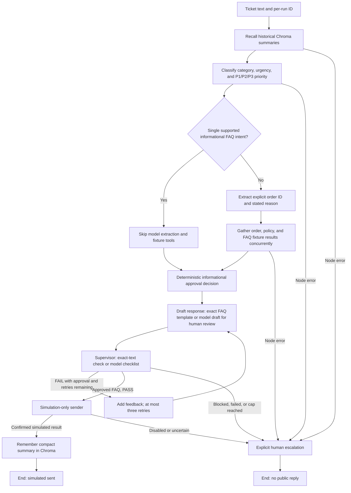
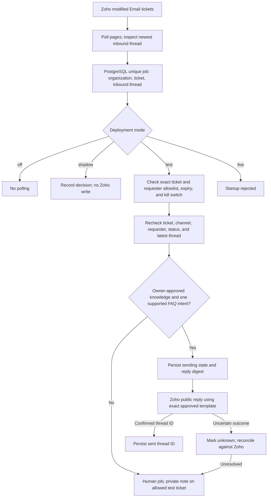

# Implemented architecture

The local LangGraph workflow and the controlled Zoho worker are separate paths.
The graph can record a **simulated** reply through a fake sender; it cannot send
customer email. The worker is implemented but has not been deployed or checked
against live Zoho polling. Its `live` mode refuses startup.

## Local ticket graph

The short-term store records node outputs for one ticket run. Historical Chroma
summaries are untrusted context and never approval evidence. A covered FAQ
takes a fast path with an exact versioned template; other tickets use the
configured OpenRouter model and local fixture tools for a human-review draft.
The local graph does not execute model-generated code or dispatch tools into
Docker. Node, tool, and model events are written to JSONL; provider-reported
cost is recorded when available. `astream(..., stream_mode="updates")` exposes
completed node updates, not token-by-token output.

New complete 50- and 200-case evaluations use one fresh shared ephemeral
Chroma collection per batch and a fake sender. Older saved reports may have
unknown effective recall exposure. The single-ticket Zoho command fetches
an existing Email ticket but always runs the graph in draft-only mode.

## Controlled Zoho worker

The worker does not call the graph, use Chroma as reply evidence, or send model
prose. The repository knowledge file is still `review_required`, so controlled
test sending requires an owner's review and matching hash before it can start.
Real customer release also requires authoritative business sources, reviewed
cases, shadow validation, and a separate decision.
