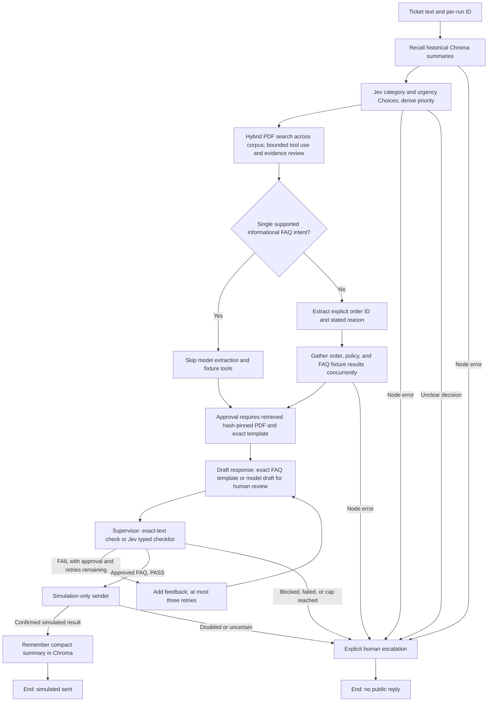
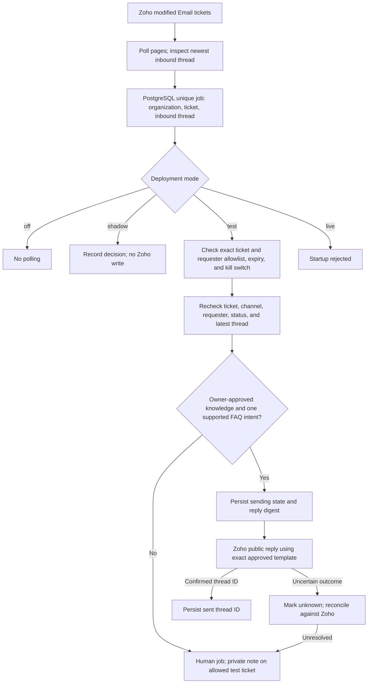

# Implemented architecture

The local LangGraph workflow and the controlled Zoho worker are separate paths.
The graph can record a **simulated** reply through a fake sender; it cannot send
customer email. The worker is implemented but has not been deployed or checked
against live Zoho polling. Its `live` mode refuses startup.

## Local ticket graph

The short-term store records node outputs for one ticket run. Historical Chroma
summaries are untrusted context and never approval evidence. With RAG enabled,
every ticket runs Jev and hybrid PDF evidence review; a covered FAQ uses an
exact versioned template only after matching retrieved evidence. Other tickets use
the generative OpenRouter model and local fixture
tools for a human-review draft. Jev uses `/api/alpha/decisions` with typed
questions; the draft model uses chat completions. An unclear or malformed
decision escalates, and probabilities are recorded separately from supervisor
confidence.

`knowledgebase/` stores actual text-layer PDFs. `src.knowledge.ingest` writes
dense MiniLM vectors to separate persistent Chroma and sparse BM25 vectors to
a SQLite ledger. Relative-filename + first-150-word SHA-256 plus pipeline/review
versions makes immutable-document ingestion idempotent. Revisions need new
filenames; later edits are not detected. Full-content hashing is only an
index-time provenance check. Only committed generations are searched. RRF combines rankings;
category is a hint, never a hard document mapping. The fixed `knowledge_search`
tool permits at most three calls per gather step. Generated human drafts return
validated citations; citation validity is not proof of entailment or approval.
With `RAG_ENABLED=false`, the historical FAQ shortcut remains for comparison.
The local graph does not execute model-generated code or dispatch tools into
Docker. Node, tool, and model events are written to JSONL; provider-reported
cost is recorded when available. `astream(..., stream_mode="updates")` exposes
completed node updates, not token-by-token output.

New complete 50- and 200-case evaluations use one fresh shared ephemeral
Chroma collection per batch and a fake sender. Older saved reports may have
unknown effective recall exposure. The single-ticket Zoho command fetches
an existing ticket with usable text and always runs the graph in draft-only
mode. Its optional reviewed-email step requires operator confirmation and
uses a fixed acknowledgement when the agent draft fails review.

## Controlled Zoho worker

The worker does not call the graph, use Chroma as reply evidence, or send model
prose. The repository knowledge file is still `review_required`, so controlled
test sending requires an owner's review and matching hash before it can start.
Real customer release also requires authoritative business sources, reviewed
cases, shadow validation, and a separate decision.

## TASK-38: Jev supervisor review

Generated human-review drafts use one OpenRouter Decisions request with three
Choice questions (pass, fail, insufficient_evidence). Configure
`OPENROUTER_SUPERVISOR_MODEL` independently from triage and drafting; its default
is `typesafe/jev-1.13`. Each check must select pass with probability >= 0.90.
This initial threshold is provisional, not calibrated. Fixed checklist guidance
supplies retry feedback; it does not identify individual unsupported sentences.
Malformed or unavailable reviews escalate. Exact approved FAQ templates retain
local validation without a supervisor model call. Checklist completion score is
not Jev probability. Current tools remain fictional; cited PDF guidance and
historical summaries do not verify customer identity. Safety gates and live-send
restrictions remain in force. Earlier generative-supervisor descriptions are
historical; accuracy and speed changes require new measured reports.

## TASK-41: One fictional business policy source

`data/policies/support_v1.json` is the validated source for delivered-only
eligibility, inclusive 30-day returns and inclusive 7-day damage reporting.
The checker and generated PDF guidance consume these same rules. Results and
retrieved chunks carry policy ID, version, source hash and rule IDs; window
eligibility never authorizes a business action. Safety incidents and policy
exceptions require human review independently of eligibility.

Generate reference PDFs with `python -m src.knowledge.export_policy`, then
index with `python -m src.knowledge.ingest`. Identical exports and indexes skip
completed documents. A change under an existing PDF/policy version fails
export; use a new version and extend the validated loader's supported version
before adoption. Expanded legacy PDFs remain on disk; superseded return/damage
references are excluded from active RAG context. The corpus has 13 PDFs: seven
original references, four exact simulation replies, two generated policy
references. The legacy seed exporter refuses to overwrite existing references.

With RAG enabled, a used policy result requires matching active retrieved rule
metadata. Missing, conflicting or obsolete policy evidence produces explicit
safety findings and human escalation even if Jev passes. Business policy
provenance is separate from `informational_only_v4` send policy. Reports and
holdout resume checks include the active business policy; historical reports
remain readable. Chroma history and fictional orders cannot authorize real
customer-specific claims, and real customer sending remains disabled.

Earlier descriptions of hardcoded checker windows and duplicated policy prose
are historical. This is consistency validation, not merchant approval or a
claim of improved model accuracy. New measurements require a completed run.
