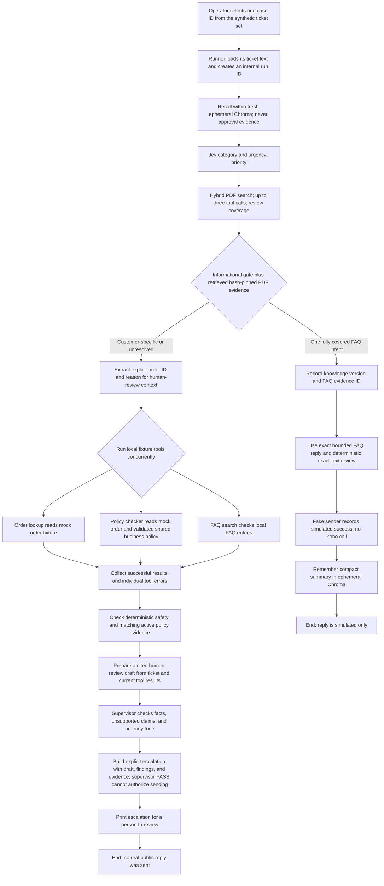
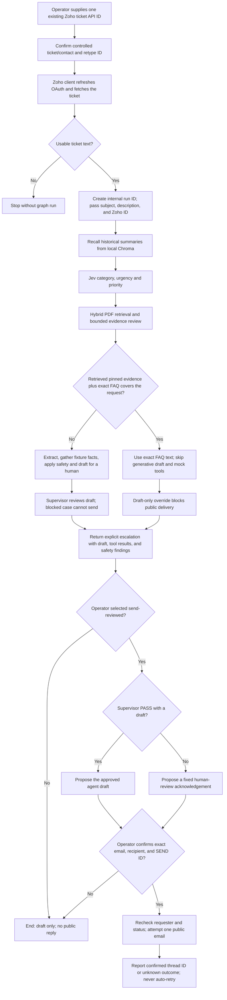
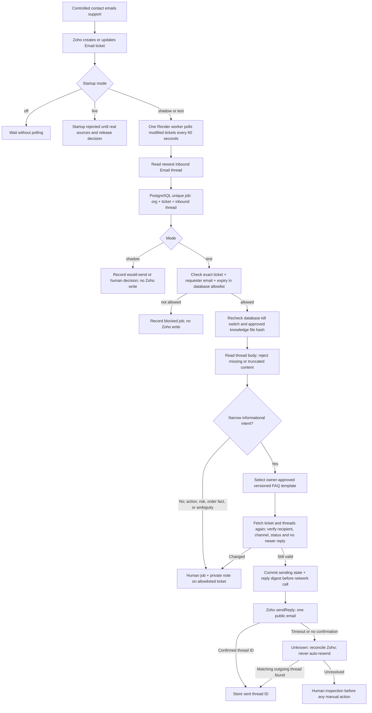

# How the support-ticket agent works

This guide explains the project in three stages:

1. Run the agent without Zoho Desk.
2. Run the current agent with Zoho ticket intake in draft-only mode, with an
   optional human-reviewed email to a controlled contact.
3. Run a controlled Zoho worker for allowlisted informational replies.

All three diagrams describe code in this repository. The controlled worker in
the third diagram is implemented but has not been deployed; its `live` mode
refuses startup and the local knowledge file is not owner-approved. The
interactive Zoho command fetches and analyzes a ticket; its optional reviewed
mode can send one public email after explicit operator approval.

## The pieces, in plain language

- **Caller:** The script, test, or future application that starts a run. It
  supplies the ticket text and an internal `ticket_id`. The draft-only Zoho
  command accepts Zoho's numeric ticket API ID and fetches its text.
- **LangGraph:** Runs the steps below in order and keeps the results together
  as one ticket's state.
- **OpenRouter:** The current model provider. Jev uses the Decisions endpoint
  to choose category and urgency from typed rubrics. Generative models use the
  chat endpoint to extract an explicit order ID/reason, review retrieved evidence,
  and draft. Jev separately reviews generated drafts through Decisions.
  Both use `.env` settings and the same rate budget. With PDF RAG enabled,
  every ticket runs Jev and evidence review. Covered FAQs skip generative
  drafting only after retrieval verifies matching simulation guidance.
- **PDF RAG:** Actual documents in `knowledgebase/` are indexed by one CLI.
  Chroma stores dense MiniLM vectors; SQLite stores sparse BM25 vectors and
  the relative-filename plus first-150-word skip ledger. The agent can search across all documents up to
  three times, review passages and cite file/page/chunk IDs in human drafts.
  Category is a hint, not a document selector. New PDFs are unreviewed.
- **Mock tools:** Local Python tools that read the small order fixture, apply
  the project's sample return/damage rules, and search a small FAQ list. They
  do not call a store, payment processor, or shipping carrier.
- **Short-term memory:** A Python dictionary scoped to the current run. It lets
  the nodes and caller inspect this ticket's intermediate state.
- **Long-term memory:** Ordinary local runs use Chroma at `CHROMA_PERSIST_DIR`;
  complete synthetic evaluations use fresh shared ephemeral Chroma. The agent
  recalls similar summaries before working. Those summaries are historical
  context, not proof of current order facts. The current graph writes a summary
  after a reply is confirmed simulated; it does not write one on the escalation
  path.
- **Reply sender:** A small interface for sending an approved reply. The normal
  benchmark injects a fake sender that records simulated success and never
  calls Zoho. The Zoho graph runs with delivery forcibly disabled; the reviewed
  CLI mode is a separate, manually authorized sender.
- **Escalation:** A structured result containing the ticket, available tool
  results, failed drafts and feedback, and a reason. The current graph returns
  this result to its caller; it does not itself assign the ticket to a person or
  notify a human in Zoho.

### What a run needs

| Run mode | Required input/configuration |
|---|---|
| One synthetic case | A case ID from the test-ticket manifest, OpenRouter API key/base URL/primary model/fallback models. Uses an injected fake sender and ephemeral Chroma; no Zoho credentials or persistent Chroma are used. |
| Zoho ticket draft | OpenRouter settings, a Zoho ticket API ID, Zoho ticket-read credentials, and the operator's interactive confirmations. Fetches and analyzes without sending. |
| Reviewed Zoho email | The same settings plus send-enabled configuration and Zoho update scope. Proposes a supervisor-approved draft or, on failed/missing draft review, a fixed acknowledgement. Exact recipient and `SEND`/ticket confirmation are required for one public email. |
| Full synthetic benchmark | The 50 development tickets or frozen 200-case author-labeled holdout, configured model credentials, and an injected fake sender. No Zoho ticket IDs or Zoho credentials are needed for delivery. |

For tickets routed to human review, the graph makes separate model calls for
classification, ticket-detail extraction, drafting, and supervisor review.
An exact supported FAQ reply skips drafting/extraction and mock business tools,
but with RAG enabled it still runs Jev and PDF retrieval/evidence review.
Blocked human-review cases do not retry. The OpenRouter client applies the configured request pacing before API
attempts, supplies the configured model fallback list, and handles bounded
429 retries. The structured logger writes run/node/tool/model events to
`data/logs/events.jsonl`.

### What the current tools and Docker setup do

The graph currently runs its mock tools as local Python code. The Docker image
and Compose configuration define a network-isolated tool sandbox, but the
current graph does not dispatch these three tools into that container. The
fixtures are useful for development and evaluation; they are not live business
data integrations.

## 1. Synthetic workflow without Zoho Desk (simulated delivery)

Use this mode to test one ticket without a helpdesk. The graph and controlled
worker share an informational-only approval rule. A fully covered general FAQ
uses exact versioned text and a fake sender; customer-specific and other
unresolved tickets escalate with no public reply. No Zoho API is called.

```powershell
.\.venv\Scripts\python.exe -m src.agent.run_synthetic --case-id order_01
```



### What happens at each step

1. **Start:** A caller supplies the message and a stable internal ticket ID.
   The internal ID scopes memory and logs. It is not the same as a Zoho ticket
   ID.
2. **Recall:** Chroma searches for similar saved summaries using the current
   ticket text. If recall fails, the run continues with no recalled facts and
   records the memory error.
3. **Classify:** With PDF RAG enabled, Jev answers two Choice questions
   in one OpenRouter Decisions call: support category and low/medium/high
   urgency. Its option probabilities, confidence, and exact served model are
   recorded in `triage_decision`. An unclear category or invalid answer
   escalates. Explicit safety/urgency signals may raise priority; category
   regex overrides no longer replace Jev's choice. No triage probability
   authorizes a public reply.
4. **Retrieve, extract and gather:** Search the PDF corpus with dense + sparse
   ranking and RRF; the model may reformulate the query twice and reviews
   completeness. Retrieved passages are untrusted and cannot override safety.
   For non-informational cases, OpenRouter extracts an order ID only if it appears
   explicitly in the ticket. Then `order_lookup`, `policy_checker`, and
   `faq_search` run concurrently. A missing/unknown order can make an
   order-dependent tool fail while the other results are retained.
5. **Safety decision:** A versioned, simulation-only FAQ entry can authorize one
   general informational reply. The decision records a reason code, evidence
   ID, and knowledge version. The original 50/50 report used a broader rule;
   the current informational manifest labels only seven FAQ cases auto-resolvable.
   If policy results are used, active retrieved policy ID/version/hash/rule IDs
   must match the checker; mismatches require human review.
6. **Draft:** OpenRouter receives the ticket, classifications, and documented
   tool fields. Tool text, ticket text, memory, and review feedback are treated
   as untrusted data, not instructions. Generated human drafts return cited
   chunk IDs; the application rejects citations outside the retrieved set.
7. **Review:** The supervisor checks tool grounding, unsupported claims, and
   urgency-appropriate tone for a human-review draft. Blocked cases escalate
   after that review without spending retry attempts. An exact FAQ template
   receives a deterministic exact-text check instead of an LLM review.
8. **Simulated delivery:** Only the exact FAQ text reaches the fake sender. A
   customer-specific draft escalates even if the supervisor passes. Chroma
   summaries and mock orders never authorize a public reply.
9. **End:** The synthetic command reports either `sent` with the explicit
   `simulated` marker, or `escalated`.
   A critical graph-node or model failure also routes to an explicit
   escalation. A failed individual tool is kept in the results while the other
   tools continue.

For a local demonstration, use the command above and choose one case ID from
the manifest. Other callers can pass ticket text to
`build_graph(...).ainvoke(...)`. This is a local Python entry point, not an
HTTP API endpoint.

## 2. Current workflow with Zoho Desk connected

The operator supplies one existing ticket API ID. The command asks the
operator to confirm it is a controlled ticket/contact, fetches its subject and
description, validates usable text for any ticket channel, then runs
the same graph. The graph itself cannot send a public reply. A separate CLI
step can send the exact draft after an operator reviews it and confirms the
controlled recipient. The command does not automatically poll Zoho.

```powershell
.\.venv\Scripts\python.exe -m src.agent.run_zoho --ticket-id YOUR_TICKET_API_ID --draft-only
.\.venv\Scripts\python.exe -m src.agent.run_zoho --ticket-id YOUR_TICKET_API_ID --send-reviewed
```



The deterministic gate blocks or routes for clarification when billing cannot
be verified, order data is missing or unavailable, a customer reports a safety
issue, requests a manager, asks for a policy exception, or leaves the desired
resolution ambiguous. The Jev supervisor remains a review signal; PASS alone
does not authorize delivery. The graph returns the current draft and findings
for an operator. `--send-reviewed` is a human-approved exception for a
controlled test ticket and contact. A failed review sends only the fixed
acknowledgement after confirmation, never the failed draft. It does not make fixture-backed order
answers safe for unattended customer delivery. The standalone `zoho_smoke`
command still sends one fixed message after confirmation without running the
agent.

The standalone Zoho smoke command is separate from a graph run. It sends one
fixed test message to one existing ticket only after the operator identifies a
controlled ticket/contact and confirms the exact ticket ID. It is not the
normal ticket-processing workflow.

## 3. Controlled Zoho worker now implemented

This is a separate, deterministic outbound path for an owner-controlled demo.
It does **not** send LangGraph-generated prose. The Zoho runner in Flow 2
still runs draft-only inside the graph; its optional reviewed CLI email is a
separate manual action. The worker uses the latest inbound email thread and a
reviewed repository template. All other issues are routed to a human.



1. **Intake:** Zoho remains the ticket and email system. The worker asks for
   modified tickets, paginates, then reads each ticket's thread history. A
   message is eligible only when the newest thread is an incoming Email.
2. **Deduplication:** PostgreSQL rejects a second job for the same
   organization, ticket, and inbound thread. The cursor uses a short overlap
   so repeated poll results are harmless. One worker instance is required.
3. **Decision:** The worker's fixed policy selects only tracking-link,
   carrier-delay, refund-timing, or payment-method guidance. Templates are
   repository files reviewed by a support-policy owner. They cannot state a
   particular order/refund status or take a business action. Injury, manager,
   billing, exception, or unclear cases go to a human.
4. **Test authorization:** The allowlist requires the exact numeric ticket API
   ID, controlled requester email, and expiration. The switch in PostgreSQL
   defaults off. Changing only an environment flag cannot bypass these checks.
5. **Delivery:** Immediately before the POST, the Zoho adapter rechecks the
   ticket and latest thread. The job is marked `sending` before network I/O.
   A timeout is ambiguous and cannot be retried automatically; a later
   poll looks for a matching outgoing thread.
6. **Privacy:** The worker does not use Chroma recall or local mock orders for
   public text. Deployment JSONL events omit ticket bodies and drafts.
   PostgreSQL keeps minimal job metadata and purges old rows.
7. **Real customers:** `live` fails startup. Authoritative order, shipment,
   billing, and policy sources and requester identity verification do not
   exist yet. A reviewed 200-case release set, 100 real shadow decisions,
   controlled restart/send tests, and separate release decision remain open.

The older 25-ticket evaluation exercises the LangGraph draft workflow with a
fake sender. Its simulated 23/25 result and ~94-second p95 are historical
baseline measurements. The newer 50-ticket informational-only run and frozen
200-case synthetic holdout also measure the local graph, not this controlled
worker or real customer accuracy. The fixed Docker tool runner is a placeholder;
the graph's fixed Python tools currently execute in the host process.


## TASK-38: Jev supervisor review

Generated human-review drafts use one OpenRouter Decisions request with three
Choice questions (pass, fail, insufficient_evidence). Configure
`OPENROUTER_SUPERVISOR_MODEL` independently from triage and drafting; its default
is `typesafe/jev-1.13`. Each check must select pass with probability >= 0.90.
This initial threshold is provisional, not calibrated. Fixed checklist guidance
supplies retry feedback; it does not identify individual unsupported sentences.
Malformed or unavailable reviews escalate. Exact approved FAQ templates retain
local validation without a supervisor model call. Checklist completion score is
not Jev probability. Current tools remain fictional; cited PDF guidance and
historical summaries do not verify customer identity. Safety gates and live-send
restrictions remain in force. Earlier generative-supervisor descriptions are
historical; accuracy and speed changes require new measured reports.

## TASK-40: Evidence-bound safety assessment

The graph and controlled worker share `production_policy.decide_public_reply`
under `informational_only_v4`. The assessment records all detected blockers,
specific missing evidence, knowledge IDs/version and policy version. Separate
questions must be covered by the same approved reply; unsupported actions,
safety incidents, billing disputes and customer-specific facts remain human work.
This is a bounded informational policy, not a general proof of intent coverage.

RAG approval additionally requires an explicitly scoped
`automatic_reply_simulation` PDF containing the exact v1 reply, with trusted
hash-pinned provenance and a cited, sufficient coverage review. The current corpus has seven reference PDFs, four simulation reply PDFs,
and two generated shared-policy references (13 total).
Neither historical Chroma summaries nor reference-only PDFs authorize sending.
The final graph delivery step rechecks evidence and exact outgoing text; the
worker also checks exact template text. Jev PASS cannot override any blocker.

Reindex with `python -m src.knowledge.ingest`. Run the fake-only benchmark with
`python -m src.eval.run_eval`; reproduce saved metrics with
`python -m src.eval.run_eval --report PATH`. Real customer sending stays disabled.
Approved simulation content is not merchant approval or production evidence.

## TASK-41: One fictional business policy source

`data/policies/support_v1.json` is the validated source for delivered-only
eligibility, inclusive 30-day returns and inclusive 7-day damage reporting.
The checker and generated PDF guidance consume these same rules. Results and
retrieved chunks carry policy ID, version, source hash and rule IDs; window
eligibility never authorizes a business action. Safety incidents and policy
exceptions require human review independently of eligibility.

Generate reference PDFs with `python -m src.knowledge.export_policy`, then
index with `python -m src.knowledge.ingest`. Identical exports and indexes skip
completed documents. A change under an existing PDF/policy version fails
export; use a new version and extend the validated loader's supported version
before adoption. Expanded legacy PDFs remain on disk; superseded return/damage
references are excluded from active RAG context. The corpus has 13 PDFs: seven
original references, four exact simulation replies, two generated policy
references. The legacy seed exporter refuses to overwrite existing references.

With RAG enabled, a used policy result requires matching active retrieved rule
metadata. Missing, conflicting or obsolete policy evidence produces explicit
safety findings and human escalation even if Jev passes. Business policy
provenance is separate from `informational_only_v4` send policy. Reports and
holdout resume checks include the active business policy; historical reports
remain readable. Chroma history and fictional orders cannot authorize real
customer-specific claims, and real customer sending remains disabled.

Earlier descriptions of hardcoded checker windows and duplicated policy prose
are historical. This is consistency validation, not merchant approval or a
claim of improved model accuracy. New measurements require a completed run.


## Latest measured development run (TASK-43)

TASK-43: 50 attempted, 50 scored, 47 matched; disposition match 0.94; 0 false simulated sends, 3 false escalations, 0 operational failures. Full-run p95: 52145.7439000078 ms; reported token cost: 0.245525665. See [saved measurement](docs/measurements/task43_regression.json).
The current result uses informational-only labels and fake delivery. Historical fixture-backed and pre-Jev/RAG reports do not describe this run. The 200-case and independent release evaluations remain separate and were not rerun.
