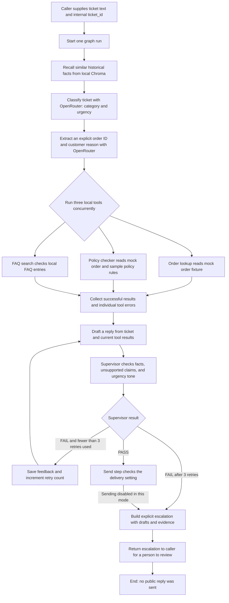
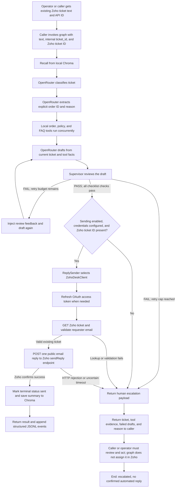
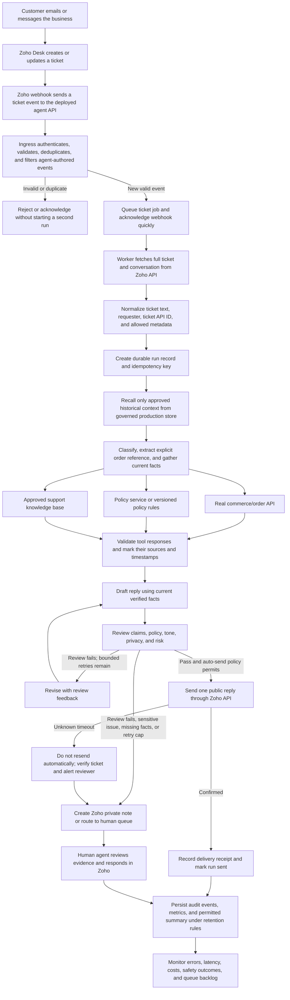

# How the support-ticket agent works

This guide explains the project in three stages:

1. Run the agent without Zoho Desk.
2. Run the current agent with the Zoho Desk reply integration.
3. Integrate the agent into a production support system.

The first two diagrams describe the code in this repository. The third is a
recommended future system design; it is **not implemented yet**. The distinction
matters: the current Zoho connection can send a reply to a ticket when the
application is invoked, but it does not yet receive new tickets automatically.

## The pieces, in plain language

- **Caller:** The script, test, or future application that starts a run. It
  supplies the ticket text and an internal `ticket_id`. To send through Zoho,
  it must also supply Zoho's numeric ticket API ID.
- **LangGraph:** Runs the steps below in order and keeps the results together
  as one ticket's state.
- **OpenRouter:** The current model provider. It classifies the ticket,
  extracts an explicitly written order ID and reason, drafts a reply, and
  reviews the draft. The application uses the OpenAI-compatible API with
  settings from `.env`.
- **Mock tools:** Local Python tools that read the small order fixture, apply
  the project's sample return/damage rules, and search a small FAQ list. They
  do not call a store, payment processor, or shipping carrier.
- **Short-term memory:** A Python dictionary scoped to the current run. It lets
  the nodes and caller inspect this ticket's intermediate state.
- **Long-term memory:** Local Chroma storage at `CHROMA_PERSIST_DIR`. The agent
  recalls similar summaries before working. Those summaries are historical
  context, not proof of current order facts. The current graph writes a summary
  after a reply is confirmed sent; it does not write one on the escalation
  path.
- **Reply sender:** A small interface for sending an approved reply. The normal
  application uses the Zoho adapter when sending is enabled; the benchmark
  injects a fake sender that records simulated success and never calls Zoho.
- **Escalation:** A structured result containing the ticket, available tool
  results, failed drafts and feedback, and a reason. The current graph returns
  this result to its caller; it does not itself assign the ticket to a person or
  notify a human in Zoho.

### What a run needs

| Run mode | Required input/configuration |
|---|---|
| Local, no Zoho send | Ticket text, an internal `ticket_id`, OpenRouter API key/base URL/primary model/fallback models, and a usable Chroma directory. `ZOHO_DESK_SEND_ENABLED` defaults to `false`. |
| Real Zoho send | Everything above, plus `ZOHO_DESK_SEND_ENABLED=true`, a Zoho ticket API ID, Desk and Accounts domains, organization ID, sender email, OAuth client ID/secret, and refresh token. |
| Full synthetic benchmark | The 25 fixed synthetic tickets, configured model credentials, and the evaluator's injected fake sender. No Zoho ticket IDs or Zoho credentials are needed for delivery. |

The graph makes separate model calls for classification, ticket-detail
extraction, drafting, and supervisor review. Each retry drafts and reviews
again. The OpenRouter client applies the configured request pacing before API
attempts, supplies the configured model fallback list, and handles bounded
429 retries. The structured logger writes run/node/tool/model events to
`data/logs/events.jsonl`.

### What the current tools and Docker setup do

The graph currently runs its mock tools as local Python code. The Docker image
and Compose configuration define a network-isolated tool sandbox, but the
current graph does not dispatch these three tools into that container. The
fixtures are useful for development and evaluation; they are not live business
data integrations.

## 1. Current workflow without Zoho Desk

Use this mode to test classification, tool gathering, drafting, review,
retries, and escalation without connecting a helpdesk account. Sending is
disabled by default with `ZOHO_DESK_SEND_ENABLED=false`.

### What happens at each step

1. **Start:** A caller supplies the message and a stable internal ticket ID.
   The internal ID scopes memory and logs. It is not the same as a Zoho ticket
   ID.
2. **Recall:** Chroma searches for similar saved summaries using the current
   ticket text. If recall fails, the run continues with no recalled facts and
   records the memory error.
3. **Classify:** OpenRouter returns a category (order status, return request,
   damaged item, billing dispute, or general question) and urgency (low,
   medium, or high).
4. **Extract and gather:** OpenRouter extracts an order ID only if it appears
   explicitly in the ticket. Then `order_lookup`, `policy_checker`, and
   `faq_search` run concurrently. A missing/unknown order can make an
   order-dependent tool fail while the other results are retained.
5. **Draft:** OpenRouter receives the ticket, classifications, and documented
   tool fields. Tool text, ticket text, memory, and review feedback are treated
   as untrusted data, not instructions.
6. **Review and retry:** The supervisor checks tool grounding, unsupported
   claims, and urgency-appropriate tone. A failed draft gets feedback and can
   be regenerated up to three times after the first draft. Classification and
   tool calls are not repeated on those retries.
7. **No-send outcome:** With sending disabled, even a passing draft is not sent.
   The graph returns an escalation containing the approved draft so a person
   can decide what to do. No message is automatically placed in Zoho or emailed
   to a customer.
8. **End:** A run ends as either `sent` or `escalated`. In this no-Zoho mode,
   it normally ends as `escalated`, because there is no delivery system.
   A critical graph-node or model failure also routes to an explicit
   escalation. A failed individual tool is kept in the results while the other
   tools continue.

For a local demonstration, `python -m src.agent.graph` invokes a hard-coded
sample ticket and prints the graph result. Other callers can pass their own
ticket text to `build_graph(...).ainvoke(...)`. This is currently a Python
entry point, not an HTTP API endpoint.

## 2. Current workflow with Zoho Desk connected

This is the current repository's real Zoho integration. A caller must already
have the ticket text and Zoho ticket API ID and invoke the graph. The agent
does **not** currently poll Zoho or receive a webhook when a ticket arrives.

### What the current Zoho connection does

1. **The caller provides the ticket.** The current sample and graph API accept
   ticket text. The caller separately provides `zoho_ticket_id` when a real
   reply is intended. The internal run ID is used for state and logging.
2. **The graph decides whether a reply is eligible.** It runs the same recall,
   classification, extraction, mock-tool, draft, supervisor, and bounded-retry
   path as Diagram 1.
3. **The send gate fails closed.** Sending requires
   `ZOHO_DESK_SEND_ENABLED=true`, a Zoho ticket ID, complete Zoho credentials,
   and a passing supervisor result with all three checks passing (score 1.0).
   Without any of these, the graph returns an escalation instead.
4. **The Zoho adapter authenticates.** It uses the configured OAuth client ID,
   client secret, refresh token, region-specific Accounts/Desk domains,
   organization ID, and sender email. It obtains/refreshes an access token.
5. **The adapter checks the existing ticket.** It requests the supplied ticket
   from Zoho and validates its requester email. It does not create tickets.
6. **The adapter sends one public reply.** It calls Zoho Desk's reply endpoint
   with the draft. There is no automatic retry after an ambiguous send timeout,
   because retrying might send a duplicate.
7. **The graph records the outcome.** A confirmed send ends as `sent` and saves
   a compact summary to Chroma. A rejected, uncertain, disabled, or otherwise
   blocked send ends as `escalated` and returns a payload to the caller.
8. **Logging:** Graph nodes, tools, model calls, and reply-sender outcomes are
   appended to `data/logs/events.jsonl`. Logs are for local observability; they
   are not a ticket queue or a human-notification system.

The standalone Zoho smoke command is separate from a graph run. It sends one
fixed test message to one existing ticket only after the operator identifies a
controlled ticket/contact and confirms the exact ticket ID. It is not the
normal ticket-processing workflow.

## 3. Recommended production workflow with Zoho Desk

This diagram shows how the pieces should cooperate in a deployed service. It
adds the missing inbound connection and real business-data adapters. Those
parts are **future work**, not capabilities of the current repository.

### Production steps and responsibilities

1. **Ticket arrives in Zoho:** Zoho remains the system where support staff see
   tickets and customer conversations.
2. **Zoho notifies the agent service:** A webhook (or a scheduled API poller if
   webhooks are unavailable) starts processing. A deployed HTTP API is needed;
   this repository currently has no ticket-ingress server.
3. **Ingress protects and deduplicates:** The service authenticates webhook
   requests, validates the Zoho event, and uses an event/ticket idempotency
   record so Zoho retries or duplicate events do not start duplicate replies.
4. **A worker loads the ticket:** The worker fetches the latest conversation
   and fields from Zoho, then normalizes them. It should process only the
   customer text and metadata the agent needs.
5. **The agent gathers real facts:** Replace the current local mock order data
   with a controlled commerce/order API; use a maintained policy source and
   approved knowledge base. A real billing dispute cannot be resolved until an
   authorized billing data source is added. Do not treat FAQ or customer text
   as instructions.
6. **The agent drafts and reviews:** The graph can retain bounded retries, but
   production needs measured acceptance criteria and a human-review policy for
   sensitive or uncertain cases. Passing the model checklist alone should not
   authorize high-impact actions.
7. **The system chooses a safe terminal action:** A low-risk, policy-approved
   response can be sent through Zoho. Missing evidence, billing disputes,
   safety complaints, angry/high-stakes cases, and exhausted reviews should be
   added to a Zoho human queue or private note, with the evidence and reason.
   The current escalation is only returned to its caller; the production
   connector must actually route it to people.
8. **Delivery is recorded exactly once:** Persist the provider response and
   event key. If a send times out and the result is unknown, check Zoho before
   any manual or automated resend.
9. **Audit and improve:** Store only permitted data, apply retention and access
   controls, and monitor delivery, safety, latency, model cost, and escalation
   rates. Keep secrets out of logs and keep production data separate from
   synthetic fixtures.
10. **Prevent webhook loops:** Agent-authored public replies can trigger ticket
    update events. Configure the receiver to ignore its own sender/event type
    or otherwise recognize agent-generated updates.

## Current project versus production target

| Capability | Current repository | Production target |
|---|---|---|
| How a run starts | A local script/caller provides ticket text | Authenticated Zoho webhook or controlled poller |
| Ticket source | Supplied by caller; graph does not fetch conversation | Worker fetches and normalizes current ticket thread |
| Order, policy, and FAQ facts | Local mock fixtures and keyword FAQ | Authorized commerce API, maintained policy source, approved knowledge base |
| Model | Configured OpenRouter-compatible API | Provider chosen by deployment policy, with budget and privacy controls |
| Short-term state | In-memory per graph run | Durable job/run state if workers need restart recovery |
| Long-term memory | Local Chroma | Governed database/vector service with access, deletion, and retention controls |
| Approved reply | Optional Zoho outbound adapter | Idempotent, audited delivery to the same ticket |
| Escalation | Returned to caller; not routed to a human automatically | Zoho assignment/private note or a staffed review queue |
| Dashboard/monitoring | Local JSONL and local dashboard | Centralized protected logs, alerts, retention, and operational monitoring |
| Tool isolation | Docker config exists; current mock graph calls run locally | Enforced isolated workers with least privilege and outbound allowlists |

### Key takeaway

In the current project, the agent is a workflow that can analyze supplied
ticket text, consult local sample tools, draft and review a response, and
optionally send one approved reply to an existing Zoho ticket. Zoho is currently
an **outbound delivery adapter**, not the source that automatically feeds new
tickets into the agent. In production, Zoho would provide the ticket event and
conversation, the agent service would fetch verified business facts and make a
bounded decision, and Zoho would receive either one approved public reply or a
human-review handoff.
