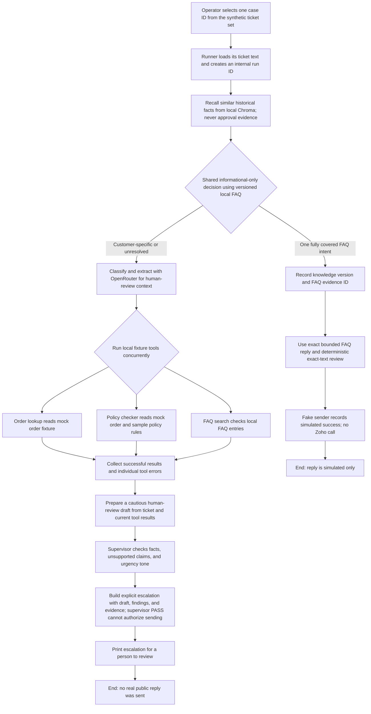
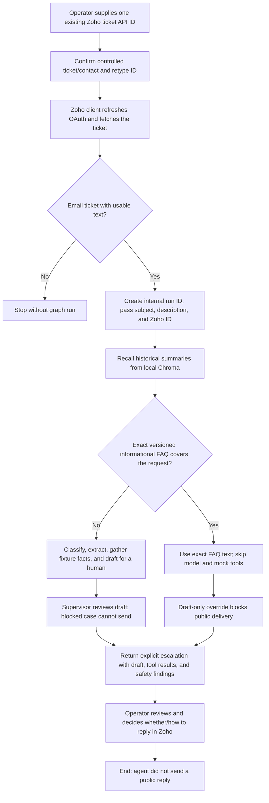
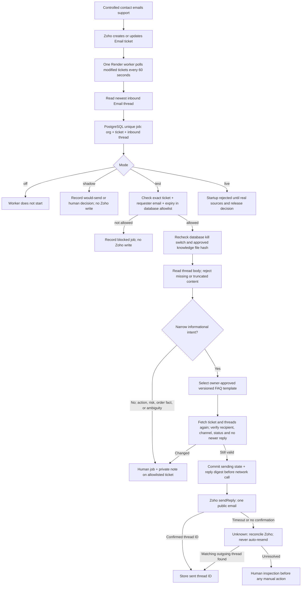

# How the support-ticket agent works

This guide explains the project in three stages:

1. Run the agent without Zoho Desk.
2. Run the current agent with Zoho ticket intake in draft-only mode.
3. Run a controlled Zoho worker for allowlisted informational replies.

All three diagrams describe code in this repository. The controlled worker in
the third diagram is implemented but has not been deployed; its `live` mode
refuses startup and the local knowledge file is not owner-approved. The
interactive Zoho command fetches and analyzes a ticket but cannot send a
public reply.

## The pieces, in plain language

- **Caller:** The script, test, or future application that starts a run. It
  supplies the ticket text and an internal `ticket_id`. The draft-only Zoho
  command accepts Zoho's numeric ticket API ID and fetches its text.
- **LangGraph:** Runs the steps below in order and keeps the results together
  as one ticket's state.
- **OpenRouter:** The current model provider. It classifies the ticket,
  extracts an explicitly written order ID and reason, drafts a reply, and
  reviews the draft. The application uses the OpenAI-compatible API with
  settings from `.env`.
- **Mock tools:** Local Python tools that read the small order fixture, apply
  the project's sample return/damage rules, and search a small FAQ list. They
  do not call a store, payment processor, or shipping carrier.
- **Short-term memory:** A Python dictionary scoped to the current run. It lets
  the nodes and caller inspect this ticket's intermediate state.
- **Long-term memory:** Ordinary local runs use Chroma at `CHROMA_PERSIST_DIR`;
  complete synthetic evaluations use fresh shared ephemeral Chroma. The agent
  recalls similar summaries before working. Those summaries are historical
  context, not proof of current order facts. The current graph writes a summary
  after a reply is confirmed sent; it does not write one on the escalation
  path.
- **Reply sender:** A small interface for sending an approved reply. The normal
  benchmark injects a fake sender that records simulated success and never
  calls Zoho. The Zoho workflow currently runs with delivery forcibly disabled.
- **Escalation:** A structured result containing the ticket, available tool
  results, failed drafts and feedback, and a reason. The current graph returns
  this result to its caller; it does not itself assign the ticket to a person or
  notify a human in Zoho.

### What a run needs

| Run mode | Required input/configuration |
|---|---|
| One synthetic case | A case ID from the test-ticket manifest, OpenRouter API key/base URL/primary model/fallback models. Uses an injected fake sender and ephemeral Chroma; no Zoho credentials or persistent Chroma are used. |
| Zoho ticket draft | OpenRouter settings, a Zoho ticket API ID, Zoho ticket-read credentials, and the operator's interactive confirmations. The command fetches ticket text but cannot send a reply. |
| Full synthetic benchmark | The 50 development tickets or frozen 200-case author-labeled holdout, configured model credentials, and an injected fake sender. No Zoho ticket IDs or Zoho credentials are needed for delivery. |

For tickets routed to human review, the graph makes separate model calls for
classification, ticket-detail extraction, drafting, and supervisor review.
An exact supported FAQ reply skips those calls and the mock business tools.
Blocked human-review cases do not retry. The OpenRouter client applies the configured request pacing before API
attempts, supplies the configured model fallback list, and handles bounded
429 retries. The structured logger writes run/node/tool/model events to
`data/logs/events.jsonl`.

### What the current tools and Docker setup do

The graph currently runs its mock tools as local Python code. The Docker image
and Compose configuration define a network-isolated tool sandbox, but the
current graph does not dispatch these three tools into that container. The
fixtures are useful for development and evaluation; they are not live business
data integrations.

## 1. Synthetic workflow without Zoho Desk (simulated delivery)

Use this mode to test one ticket without a helpdesk. The graph and controlled
worker share an informational-only approval rule. A fully covered general FAQ
uses exact versioned text and a fake sender; customer-specific and other
unresolved tickets escalate with no public reply. No Zoho API is called.

```powershell
.\.venv\Scripts\python.exe -m src.agent.run_synthetic --case-id order_01
```



### What happens at each step

1. **Start:** A caller supplies the message and a stable internal ticket ID.
   The internal ID scopes memory and logs. It is not the same as a Zoho ticket
   ID.
2. **Recall:** Chroma searches for similar saved summaries using the current
   ticket text. If recall fails, the run continues with no recalled facts and
   records the memory error.
3. **Decision:** A versioned, simulation-only FAQ entry can authorize one
   general informational reply. The decision records a reason code, evidence
   ID, and knowledge version. The original 50/50 report used a broader rule;
   the current 50-case manifest labels only seven FAQ cases auto-resolvable.
4. **Classify:** For tickets outside the exact FAQ path, OpenRouter returns a category (order status, return request,
   damaged item, billing dispute, or general question) and urgency (low,
   medium, or high).
5. **Extract and gather:** OpenRouter extracts an order ID only if it appears
   explicitly in the ticket. Then `order_lookup`, `policy_checker`, and
   `faq_search` run concurrently. A missing/unknown order can make an
   order-dependent tool fail while the other results are retained.
6. **Draft:** OpenRouter receives the ticket, classifications, and documented
   tool fields. Tool text, ticket text, memory, and review feedback are treated
   as untrusted data, not instructions.
7. **Review:** The supervisor checks tool grounding, unsupported claims, and
   urgency-appropriate tone for a human-review draft. Blocked cases escalate
   after that review without spending retry attempts. An exact FAQ template
   receives a deterministic exact-text check instead of an LLM review.
8. **Simulated delivery:** Only the exact FAQ text reaches the fake sender. A
   customer-specific draft escalates even if the supervisor passes. Chroma
   summaries and mock orders never authorize a public reply.
9. **End:** The synthetic command reports either `sent` with the explicit
   `simulated` marker, or `escalated`.
   A critical graph-node or model failure also routes to an explicit
   escalation. A failed individual tool is kept in the results while the other
   tools continue.

For a local demonstration, use the command above and choose one case ID from
the manifest. Other callers can pass ticket text to
`build_graph(...).ainvoke(...)`. This is a local Python entry point, not an
HTTP API endpoint.

## 2. Current workflow with Zoho Desk connected (draft-only)

The operator supplies one existing ticket API ID. The command asks the
operator to confirm it is a controlled ticket/contact, fetches its subject and
description, validates that it is an Email ticket with usable text, then runs
the same graph. This command cannot send a public reply, regardless of the
Zoho send environment setting. It does not automatically poll Zoho or receive
new tickets.

```powershell
.\.venv\Scripts\python.exe -m src.agent.run_zoho --ticket-id YOUR_TICKET_API_ID --draft-only
```



The deterministic gate blocks or routes for clarification when billing cannot
be verified, order data is missing or unavailable, a customer reports a safety
issue, requests a manager, asks for a policy exception, or leaves the desired
resolution ambiguous. The LLM supervisor remains a review signal; PASS alone
does not authorize delivery. The graph returns the current draft and findings
for an operator. The standalone `zoho_smoke` command still sends one fixed
message after explicit confirmation, but it does not run the agent.

The standalone Zoho smoke command is separate from a graph run. It sends one
fixed test message to one existing ticket only after the operator identifies a
controlled ticket/contact and confirms the exact ticket ID. It is not the
normal ticket-processing workflow.

## 3. Controlled Zoho worker now implemented

This is a separate, deterministic outbound path for an owner-controlled demo.
It does **not** send LangGraph-generated prose. The Zoho runner in Flow 2
remains draft-only. The worker uses the latest inbound email thread and a
reviewed repository template. All other issues are routed to a human.



1. **Intake:** Zoho remains the ticket and email system. The worker asks for
   modified tickets, paginates, then reads each ticket's thread history. A
   message is eligible only when the newest thread is an incoming Email.
2. **Deduplication:** PostgreSQL rejects a second job for the same
   organization, ticket, and inbound thread. The cursor uses a short overlap
   so repeated poll results are harmless. One worker instance is required.
3. **Decision:** The worker's fixed policy selects only tracking-link,
   carrier-delay, refund-timing, or payment-method guidance. Templates are
   repository files reviewed by a support-policy owner. They cannot state a
   particular order/refund status or take a business action. Injury, manager,
   billing, exception, or unclear cases go to a human.
4. **Test authorization:** The allowlist requires the exact numeric ticket API
   ID, controlled requester email, and expiration. The switch in PostgreSQL
   defaults off. Changing only an environment flag cannot bypass these checks.
5. **Delivery:** Immediately before the POST, the Zoho adapter rechecks the
   ticket and latest thread. The job is marked `sending` before network I/O.
   A timeout is ambiguous and cannot be retried automatically; a later
   poll looks for a matching outgoing thread.
6. **Privacy:** The worker does not use Chroma recall or local mock orders for
   public text. Deployment JSONL events omit ticket bodies and drafts.
   PostgreSQL keeps minimal job metadata and purges old rows.
7. **Real customers:** `live` fails startup. Authoritative order, shipment,
   billing, and policy sources and requester identity verification do not
   exist yet. A reviewed 200-case release set, 100 real shadow decisions,
   controlled restart/send tests, and separate release decision remain open.

The older 25-ticket evaluation exercises the LangGraph draft workflow with a
fake sender. Its simulated 23/25 result and ~94-second p95 are historical
baseline measurements. The newer 50-ticket informational-only run and frozen
200-case synthetic holdout also measure the local graph, not this controlled
worker or real customer accuracy. The fixed Docker tool runner is a placeholder;
the graph's fixed Python tools currently execute in the host process.
